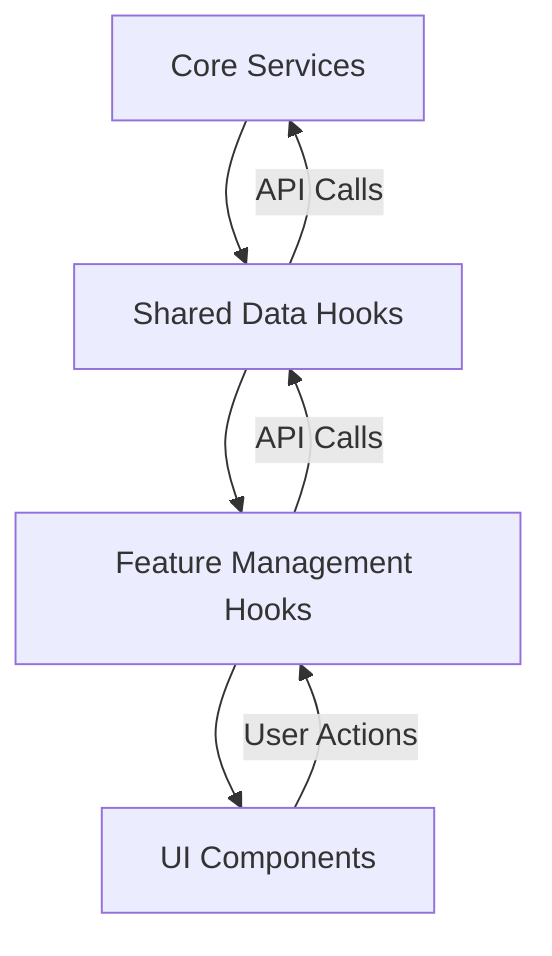

# System Patterns: Transcript Automation System Frontend

## System Architecture

The Transcript Automation System frontend follows a feature-based architecture that organizes code by domain functionality rather than technical concerns. This approach improves maintainability, scalability, and developer experience.

### Directory Structure

This directory structure has been successfully implemented in the temp_vite_v3 directory:

```
src/
├── features/                # Feature-based modules
│   └── [feature]/          # e.g., transcript, config, downloads
│       ├── components/     # Feature-specific components (always flat, no subfolders)
│       │   └── index.js    # Barrel export file
│       ├── hooks/          # Feature-specific business logic
│       │   └── index.js    # Hooks barrel export
│       └── index.js        # Feature barrel export
│
├── shared/                 # Cross-feature shared code
│   ├── components/        # Shared UI components (always flat, no subfolders)
│   │   └── index.js       # Barrel export file
│   ├── data/              # ALL data access hooks go here
│   │   └── index.js       # Data hooks barrel export
│   └── index.js           # Shared barrel export
│
├── components/            # UI components
│   └── ui/                # shadcn/ui components (never modify these)
│       └── index.js       # Barrel export file
│
├── lib/                   # Library code
│   ├── utils.js           # Utility functions
│   └── ttsOptions.js      # Text-to-speech configuration
│
└── core/                  # Application essentials
    ├── router.jsx        # Single router configuration
    ├── services/         # External service clients folder
    │   ├── api.js        # Base API client with error handling
    │   ├── transcript.js # Transcript-related API calls
    │   ├── audio.js      # Audio-related API calls
    │   ├── prompt.js     # Prompt-related API calls
    │   ├── project.js    # Project-related API calls
    │   ├── config.js     # Configuration-related API calls
    │   └── index.js      # Services barrel export
    ├── state.js          # Application-wide state (when needed)
    └── index.js          # Core barrel export
```

## Key Design Patterns

### 1. Feature-Based Organization

The application is organized around business features rather than technical layers. Each feature contains its own components and business logic, promoting cohesion and reducing coupling between unrelated parts of the application.

**Benefits:**
- Clear boundaries between features
- Easier to understand and navigate codebase
- Simplified feature development and maintenance
- Better code ownership and team collaboration

### 2. Data Hook Pattern with React Query

Data access is centralized in shared data hooks that follow a consistent pattern. These hooks use React Query for data fetching, caching, and state management, providing a clean and efficient way to interact with the backend API.

**Implementation:**
```javascript
// shared/data/useTranscriptData.js
import { useQuery, useMutation, useQueryClient } from "@tanstack/react-query";
import { transcriptService } from "@/core/services";
import { toast } from "sonner";

export function useTranscriptData() {
  const queryClient = useQueryClient();

  // Data fetching with React Query
  const { 
    data: transcripts, 
    isLoading: isLoadingTranscripts, 
    error: transcriptsError 
  } = useQuery({
    queryKey: ["transcripts"],
    queryFn: async () => {
      return await transcriptService.getTranscripts();
    },
  });

  // Mutations for modifying data
  const processTranscript = useMutation({
    mutationFn: async (data) => {
      return await transcriptService.processTranscript(data);
    },
    onSuccess: () => {
      queryClient.invalidateQueries(["transcripts"]);
      toast.success("Transcript processed successfully");
    },
    onError: (error) => {
      toast.error(`Error: ${error.message || "Failed to process transcript"}`);
    },
  });

  // Return data, operations, and loading/error states
  return {
    // Data
    transcripts,
    isLoadingTranscripts,
    transcriptsError,
    
    // Operations
    processTranscript: processTranscript.mutate,
    
    // Operation states
    isProcessing: processTranscript.isPending
  };
}
```

**Key Benefits of React Query Integration:**

1. **Automatic Caching**: Data is cached and only refetched when needed
2. **Loading and Error States**: Built-in states for loading and error handling
3. **Automatic Refetching**: Data is automatically refreshed after mutations
4. **Optimistic Updates**: Support for optimistic UI updates
5. **Pagination and Infinite Scrolling**: Built-in support for advanced data fetching patterns
6. **Devtools**: Powerful devtools for debugging and monitoring

### 3. Management Hook Pattern

Feature-specific business logic is encapsulated in management hooks that build on data hooks. These hooks handle feature-specific state and operations.

**Implementation:**
```javascript
// features/transcript/hooks/useTranscriptManagement.js
export function useTranscriptManagement() {
  // Feature-specific state
  const [selectedTranscriptId, setSelectedTranscriptId] = useState(null);
  
  // Use the shared data hook
  const { transcripts, processTranscript, isProcessing } = useTranscriptData();
  
  // Feature-specific business logic
  const selectedTranscript = transcripts?.find(t => t.id === selectedTranscriptId);
  
  const processWithCustomPrompt = (url, customPrompt) => {
    processTranscript({
      url,
      promptData: customPrompt
    });
  };
  
  return {
    transcripts,
    selectedTranscript,
    setSelectedTranscriptId,
    processWithCustomPrompt,
    isProcessing
  };
}
```

### 4. Centralized Service Layer with Error Handling

API interactions are centralized in service modules that handle all communication with the backend. These services are organized by domain and provide a clean interface for data hooks.

**Key Patterns:**

1. **Base API Client**: A centralized Axios instance with common configuration
2. **Error Handling Helper**: The `apiRequest` helper function that provides consistent error handling
3. **Toast Notifications**: Using toast from components/ui/sonner for user-friendly error messages
4. **Domain-Specific Services**: Separate service modules for each domain (transcript, audio, prompt, etc.)
5. **Clean Service Interface**: Each service exposes simple methods that abstract the API details

This approach ensures consistent error handling across the application and provides a clean interface for data hooks to interact with the backend.

### 5. Component Composition

UI components are composed from smaller, reusable components, promoting consistency and reducing duplication. shadcn/ui provides the foundation for this composition.

**Implementation:**
```jsx
// features/transcript/components/TranscriptForm.jsx
export function TranscriptForm({ onSubmit }) {
  return (
    <Card>
      <CardHeader>
        <CardTitle>Process YouTube Transcript</CardTitle>
      </CardHeader>
      <CardContent>
        <Form onSubmit={onSubmit}>
          <FormField
            name="url"
            label="YouTube URL"
            placeholder="https://www.youtube.com/watch?v=..."
          />
          <Button type="submit">Process</Button>
        </Form>
      </CardContent>
    </Card>
  );
}
```

## Component Relationships

### Data Flow

The application follows a unidirectional data flow pattern:



### Dependency Rules

1. **Features can depend on:**
   - Shared components and hooks
   - Core services and utilities
   - Other features (avoid when possible)

2. **Shared code can depend on:**
   - Core services and utilities
   - Other shared code

3. **Core can depend on:**
   - Other core modules
   - External libraries

## Import Rules

1. **Direct Data Hook Imports**
   - Components and hooks should import shared data hooks directly:
   ```javascript
   // CORRECT
   import { useTranscriptData } from '@/shared/data/useTranscriptData';
   
   // AVOID
   // import { useTranscriptData } from '@/features/transcript/hooks';
   ```

2. **Simple Dependency Chain**
   - Maintain a clean, direct dependency path:
   - Feature components → Shared data hooks → Core services

## State Management Approach

1. **Component State**
   - For UI-only state within a single component
   - Example: Form input values, toggle states

2. **Feature State**
   - For state shared between components in a feature
   - Implemented using the Management Hook Pattern

3. **Application State**
   - For state accessed across multiple features
   - Implemented using React Context in core/state.js

## Notification Standard

To ensure a consistent user experience, all notifications in the application use the toast component from the sonner library:

1. **Standard Component**: Always use toast directly from `sonner` package:
   ```javascript
   import { toast } from "sonner";
   
   // Success notification
   toast.success("Operation completed successfully");
   
   // Error notification
   toast.error("An error occurred");
   ```

2. **Toast Component**: Use the Toaster component from shadcn/ui in the application root:
   ```jsx
   import { Toaster } from "@/components/ui/sonner";
   
   function App() {
     return (
       <>
         <Toaster />
         {/* Rest of your app */}
       </>
     );
   }
   ```

3. **Usage Locations**:
   - API error handling in core services via the apiRequest helper
   - Success/error notifications in data hooks' mutation callbacks
   - User action feedback in feature components
   - Direct user feedback for important actions

4. **Notification Types**:
   - Success: `toast.success()` - For successful operations
   - Error: `toast.error()` - For error messages
   - Info: `toast.info()` - For informational messages
   - Warning: `toast.warning()` - For warning messages

5. **Benefits**:
   - Consistent notification appearance and behavior
   - Centralized styling and configuration
   - Easy to replace or update the notification system if needed
   - Improved user experience with clear feedback
