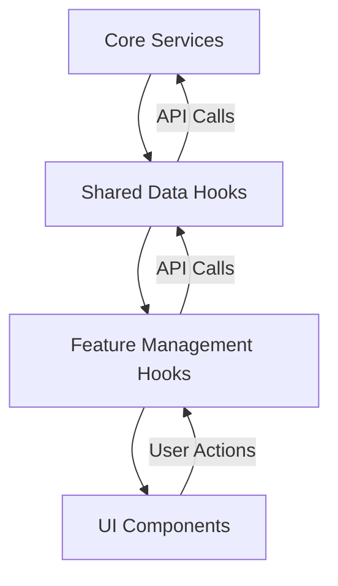

# System Patterns: Transcript Automation System Frontend

## System Architecture

The Transcript Automation System frontend follows a feature-based architecture that organizes code by domain functionality rather than technical concerns. This approach improves maintainability, scalability, and developer experience.

### Directory Structure

This directory structure has been successfully implemented in the temp_vite_v3 directory:

```
src/
├── features/                # Feature-based modules
│   └── [feature]/          # e.g., transcript, config, downloads
│       ├── components/     # Feature-specific components (always flat, no subfolders)
│       │   └── index.js    # Barrel export file
│       ├── hooks/          # Feature-specific business logic
│       │   └── index.js    # Hooks barrel export
│       └── index.js        # Feature barrel export
│
├── shared/                 # Cross-feature shared code
│   ├── components/        # Shared UI components (always flat, no subfolders)
│   │   └── index.js       # Barrel export file
│   ├── ui/                # shadcn/ui components (never modify these)
│   │   └── index.js       # Barrel export file
│   ├── data/              # ALL data access hooks go here
│   │   └── index.js       # Data hooks barrel export
│   └── index.js           # Shared barrel export
│
├── lib/                   # Library code
│   └── utils.js           # Utility functions
│
└── core/                  # Application essentials
    ├── router.js         # Single router configuration
    ├── services/         # External service clients folder
    │   └── index.js      # Services barrel export
    ├── state.js          # Application-wide state (when needed)
    └── index.js          # Core barrel export
```

## Key Design Patterns

### 1. Feature-Based Organization

The application is organized around business features rather than technical layers. Each feature contains its own components and business logic, promoting cohesion and reducing coupling between unrelated parts of the application.

**Benefits:**
- Clear boundaries between features
- Easier to understand and navigate codebase
- Simplified feature development and maintenance
- Better code ownership and team collaboration

### 2. Data Hook Pattern

Data access is centralized in shared data hooks that follow a consistent pattern. These hooks encapsulate all data fetching, mutation, and state management for a specific entity.

**Implementation:**
```javascript
// shared/data/useTranscriptData.js
export function useTranscriptData() {
  // Data fetching with React Query
  const { data: transcripts, isLoading, error } = useQuery({
    queryKey: ["transcripts"],
    queryFn: async () => {
      const response = await transcriptService.getTranscripts();
      return response;
    }
  });

  // Mutations
  const processTranscript = useMutation({
    mutationFn: async (data) => {
      const response = await transcriptService.processTranscript(data);
      return response;
    },
    onSuccess: () => {
      queryClient.invalidateQueries(["transcripts"]);
      toast.success("Transcript processed successfully");
    }
  });

  // Return data and operations
  return {
    transcripts,
    isLoading,
    error,
    processTranscript: processTranscript.mutate,
    isProcessing: processTranscript.isPending
  };
}
```

### 3. Management Hook Pattern

Feature-specific business logic is encapsulated in management hooks that build on data hooks. These hooks handle feature-specific state and operations.

**Implementation:**
```javascript
// features/transcript/hooks/useTranscriptManagement.js
export function useTranscriptManagement() {
  // Feature-specific state
  const [selectedTranscriptId, setSelectedTranscriptId] = useState(null);
  
  // Use the shared data hook
  const { transcripts, processTranscript, isProcessing } = useTranscriptData();
  
  // Feature-specific business logic
  const selectedTranscript = transcripts?.find(t => t.id === selectedTranscriptId);
  
  const processWithCustomPrompt = (url, customPrompt) => {
    processTranscript({
      url,
      promptData: customPrompt
    });
  };
  
  return {
    transcripts,
    selectedTranscript,
    setSelectedTranscriptId,
    processWithCustomPrompt,
    isProcessing
  };
}
```

### 4. Centralized Service Layer

API interactions are centralized in service modules that handle all communication with the backend. These services are organized by domain and provide a clean interface for data hooks.

**Implementation:**
```javascript
// core/services/transcriptService.js
export const transcriptService = {
  processTranscript: async (data) => {
    const response = await api.post('/transcripts/process', data);
    return response.data;
  },
  
  getTranscripts: async () => {
    const response = await api.get('/transcripts');
    return response.data;
  }
};
```

### 5. Component Composition

UI components are composed from smaller, reusable components, promoting consistency and reducing duplication. shadcn/ui provides the foundation for this composition.

**Implementation:**
```jsx
// features/transcript/components/TranscriptForm.jsx
export function TranscriptForm({ onSubmit }) {
  return (
    <Card>
      <CardHeader>
        <CardTitle>Process YouTube Transcript</CardTitle>
      </CardHeader>
      <CardContent>
        <Form onSubmit={onSubmit}>
          <FormField
            name="url"
            label="YouTube URL"
            placeholder="https://www.youtube.com/watch?v=..."
          />
          <Button type="submit">Process</Button>
        </Form>
      </CardContent>
    </Card>
  );
}
```

## Component Relationships

### Data Flow

The application follows a unidirectional data flow pattern:



### Dependency Rules

1. **Features can depend on:**
   - Shared components and hooks
   - Core services and utilities
   - Other features (avoid when possible)

2. **Shared code can depend on:**
   - Core services and utilities
   - Other shared code

3. **Core can depend on:**
   - Other core modules
   - External libraries

## Import Rules

1. **Direct Data Hook Imports**
   - Components and hooks should import shared data hooks directly:
   ```javascript
   // CORRECT
   import { useTranscriptData } from '@/shared/data/useTranscriptData';
   
   // AVOID
   // import { useTranscriptData } from '@/features/transcript/hooks';
   ```

2. **Simple Dependency Chain**
   - Maintain a clean, direct dependency path:
   - Feature components → Shared data hooks → Core services

## State Management Approach

1. **Component State**
   - For UI-only state within a single component
   - Example: Form input values, toggle states

2. **Feature State**
   - For state shared between components in a feature
   - Implemented using the Management Hook Pattern

3. **Application State**
   - For state accessed across multiple features
   - Implemented using React Context in core/state.js
