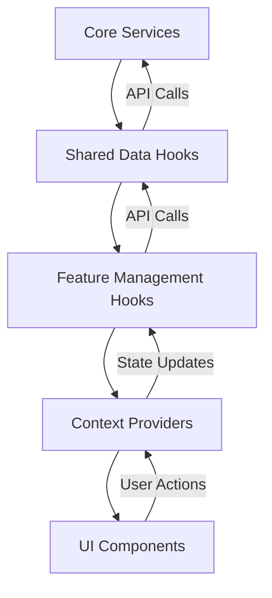
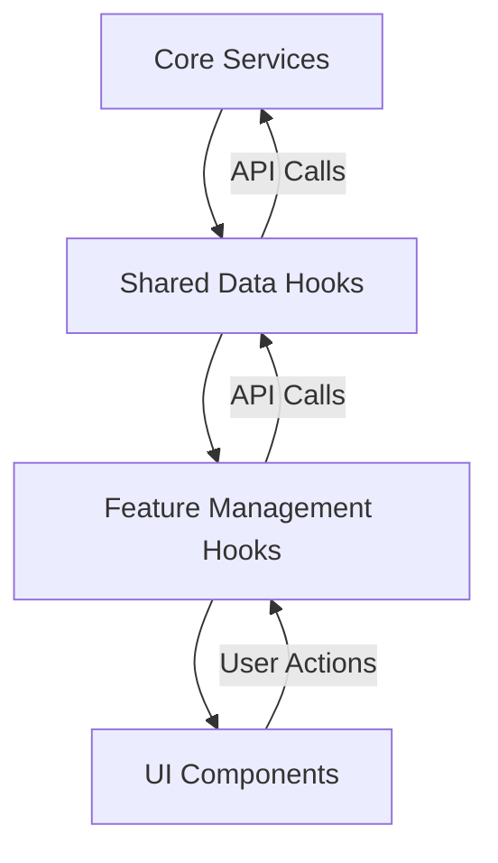

# System Patterns: Transcript Automation System Frontend

## System Architecture

The Transcript Automation System frontend follows a feature-based architecture that organizes code by domain functionality rather than technical concerns. This approach improves maintainability, scalability, and developer experience.

### Directory Structure

This directory structure has been successfully implemented in the temp_vite_v3 directory:

```
src/
├── features/                # Feature-based modules
│   └── [feature]/          # e.g., transcript, config, downloads
│       ├── components/     # Feature-specific components (always flat, no subfolders)
│       │   └── index.js    # Barrel export file
│       ├── hooks/          # Feature-specific business logic
│       │   └── index.js    # Hooks barrel export
│       └── index.js        # Feature barrel export
│
├── shared/                 # Cross-feature shared code
│   ├── components/        # Shared UI components (always flat, no subfolders)
│   │   └── index.js       # Barrel export file
│   ├── data/              # ALL data access hooks go here
│   │   └── index.js       # Data hooks barrel export
│   └── index.js           # Shared barrel export
│
├── components/            # UI components
│   └── ui/                # shadcn/ui components (never modify these)
│       └── index.js       # Barrel export file
│
├── lib/                   # Library code
│   ├── utils.js           # Utility functions
│   └── ttsOptions.js      # Text-to-speech configuration
│
└── core/                  # Application essentials
    ├── router.jsx        # Single router configuration
    ├── services/         # External service clients folder
    │   ├── api.js        # Base API client with error handling
    │   ├── transcript.js # Transcript-related API calls
    │   ├── audio.js      # Audio-related API calls
    │   ├── prompt.js     # Prompt-related API calls
    │   ├── project.js    # Project-related API calls
    │   ├── config.js     # Configuration-related API calls
    │   └── index.js      # Services barrel export
    ├── state.js          # Application-wide state (when needed)
    └── index.js          # Core barrel export
```

## Key Design Patterns

### 1. Context Provider Pattern with Pure React State

The application uses React Context with useState for UI state management, completely separate from React Query's server state management. This pattern ensures that UI state is preserved across route changes and is not affected by React Query cache invalidations.

**Pattern Structure:**
1. **Context Creation**: Define a React Context object for the feature
2. **Provider Component**: Create a provider component that manages state with useState and provides it to children
3. **Custom Hook**: Create a custom hook that uses the context and provides a clean API
4. **Wrapper Usage**: Wrap the feature's main component with the provider

**Key Improvements:**
- **State Isolation**: UI state is completely isolated from React Query cache
- **Persistence**: State persists across route changes regardless of API operations
- **Simplicity**: Direct useState management without cache dependencies
- **Predictability**: State updates follow React's standard patterns

**Implementation Example (Pseudocode):**
```
// Context Provider Pattern Pseudocode
function FeatureProvider(children) {
  // UI state with useState
  const [formState, setFormState] = useState({
    field1: defaultValue,
    field2: defaultValue
  })
  
  // Server state with React Query
  const { serverData } = useDataHook()
  
  // State updater functions
  function updateField1(newValue) {
    setFormState(prev => ({...prev, field1: newValue}))
  }
  
  // Create context value
  const contextValue = {
    // UI state and updaters
    field1: formState.field1,
    updateField1,
    
    // Server state and operations
    serverData
  }
  
  // Provide context to children
  return <Context.Provider value={contextValue}>{children}</Context.Provider>
}
```

**Real-World Application:**
In the Transcript feature, we implemented `TranscriptContext` to manage form state directly with useState instead of using React Query's cache. This ensures that form state persists across route changes and is not affected by cache invalidations.

**Benefits:**
- Ensures consistent state across all components
- Prevents state synchronization issues
- Simplifies component implementation
- Improves maintainability by centralizing state logic
- Solves the "prop drilling" problem
- Provides clear separation between UI state and server state

### 2. Feature-Based Organization

The application is organized around business features rather than technical layers. Each feature contains its own components and business logic, promoting cohesion and reducing coupling between unrelated parts of the application.

**Benefits:**
- Clear boundaries between features
- Easier to understand and navigate codebase
- Simplified feature development and maintenance
- Better code ownership and team collaboration

### 2. Data Hook Pattern with React Query

Data access is centralized in shared data hooks that follow a consistent pattern. These hooks use React Query for data fetching, caching, and state management, providing a clean and efficient way to interact with the backend API.

**Implementation Example (Pseudocode):**
```
// Data Hook Pattern Pseudocode
function useEntityData() {
  const queryClient = useQueryClient()

  // Data fetching with React Query
  const { 
    data: entities, 
    isLoading, 
    error 
  } = useQuery({
    queryKey: ["entities"],
    queryFn: () => service.getEntities()
  })

  // Mutations for modifying data
  const createEntity = useMutation({
    mutationFn: (data) => service.createEntity(data),
    onSuccess: () => {
      // Invalidate cache to refresh data
      queryClient.invalidateQueries(["entities"])
      // Show success notification
      toast.success("Entity created successfully")
    },
    onError: (error) => {
      // Show error notification
      toast.error("Failed to create entity: " + error.message)
    }
  })

  // Return data, operations, and states
  return {
    // Data
    entities,
    isLoading,
    error,
    
    // Operations
    createEntity: createEntity.mutate,
    
    // Operation states
    isCreating: createEntity.isPending
  }
}
```

**Key Benefits of React Query Integration:**

1. **Automatic Caching**: Data is cached and only refetched when needed
2. **Loading and Error States**: Built-in states for loading and error handling
3. **Automatic Refetching**: Data is automatically refreshed after mutations
4. **Optimistic Updates**: Support for optimistic UI updates
5. **Pagination and Infinite Scrolling**: Built-in support for advanced data fetching patterns
6. **Devtools**: Powerful devtools for debugging and monitoring

### 3. Management Hook Pattern

Feature-specific business logic is encapsulated in management hooks that build on data hooks. These hooks handle feature-specific state and operations.

**Implementation Example (Pseudocode):**
```
// Management Hook Pattern Pseudocode
function useFeatureManagement() {
  // Feature-specific state
  const [selectedItemId, setSelectedItemId] = useState(null)
  
  // Use the shared data hook
  const { items, createItem, updateItem, isLoading } = useEntityData()
  
  // Feature-specific business logic
  const selectedItem = items?.find(item => item.id === selectedItemId)
  
  // Business logic operations
  function processItemWithOptions(itemId, options) {
    // Transform options or add defaults
    const processOptions = {
      ...defaultOptions,
      ...options,
      timestamp: new Date()
    }
    
    // Call data hook operation with transformed data
    updateItem(itemId, processOptions)
  }
  
  // Return both data hook values and feature-specific values
  return {
    // Pass-through from data hook
    items,
    isLoading,
    
    // Feature-specific state
    selectedItemId,
    setSelectedItemId,
    selectedItem,
    
    // Feature-specific operations
    processItemWithOptions
  }
}
```

### 4. Centralized Service Layer with Error Handling

API interactions are centralized in service modules that handle all communication with the backend. These services are organized by domain and provide a clean interface for data hooks.

**Key Patterns:**

1. **Base API Client**: A centralized Axios instance with common configuration
2. **Error Handling Helper**: The `apiRequest` helper function that provides consistent error handling
3. **Toast Notifications**: Using toast from components/ui/sonner for user-friendly error messages
4. **Domain-Specific Services**: Separate service modules for each domain (transcript, audio, prompt, etc.)
5. **Clean Service Interface**: Each service exposes simple methods that abstract the API details

This approach ensures consistent error handling across the application and provides a clean interface for data hooks to interact with the backend.

### 5. Component Composition

UI components are composed from smaller, reusable components, promoting consistency and reducing duplication. shadcn/ui provides the foundation for this composition.

**Implementation Example (Pseudocode):**
```
// Component Composition Pattern Pseudocode
function FeatureComponent(props) {
  // Use shadcn/ui components as building blocks
  return (
    <Card>
      <CardHeader>
        <CardTitle>Feature Title</CardTitle>
      </CardHeader>
      <CardContent>
        <Form>
          <FormField
            name="field1"
            label="Field Label"
          />
          <FormField
            name="field2"
            label="Another Field"
          />
          <Button>Submit</Button>
        </Form>
      </CardContent>
    </Card>
  )
}
```

**Key Benefits:**
- Consistent UI appearance across the application
- Reduced duplication of styling and behavior
- Better accessibility through well-designed base components
- Easier maintenance with standardized component patterns

## Component Relationships

### Data Flow

The application follows a unidirectional data flow pattern, with the addition of the Context Provider Pattern for shared state:



For features that don't require shared state, components can use management hooks directly:



### Dependency Rules

1. **Features can depend on:**
   - Shared components and hooks
   - Core services and utilities
   - Other features (avoid when possible)

2. **Shared code can depend on:**
   - Core services and utilities
   - Other shared code

3. **Core can depend on:**
   - Other core modules
   - External libraries

## Import Rules

1. **Direct Data Hook Imports**
   - Components and hooks should import shared data hooks directly:
   ```javascript
   // CORRECT
   import { useTranscriptData } from '@/shared/data/useTranscriptData';
   
   // AVOID
   // import { useTranscriptData } from '@/features/transcript/hooks';
   ```

2. **Simple Dependency Chain**
   - Maintain a clean, direct dependency path:
   - Feature components → Shared data hooks → Core services

## State Management Approach

1. **Component State**
   - For UI-only state within a single component
   - Example: Form input values, toggle states
   - Implemented using React's useState hook

2. **Feature State**
   - For state shared between components in a feature
   - Two implementation approaches:
     - **Management Hook Pattern**: For simpler features with limited component interaction
     - **Context Provider Pattern**: For complex features where multiple components need to share and update the same state

3. **Application State**
   - For state accessed across multiple features
   - Implemented using React Context in core/state.js

### When to Use Each Approach

| Approach | Use Case | Example |
|----------|----------|---------|
| Component State | UI-specific state that doesn't affect other components | Form input values, toggle states, local loading indicators |
| Management Hook | Feature-specific state with limited component interaction | Simple form state, selected items in a list |
| Context Provider | Complex state shared across multiple components in a feature | Delete confirmation flow, multi-step wizards, complex forms |
| Application State | State that needs to be accessed across multiple features | User authentication, global settings, theme preferences |

## Notification Standard

To ensure a consistent user experience, all notifications in the application use the toast component from the sonner library:

1. **Standard Component**: Always use toast directly from `sonner` package:
   ```
   // Notification Pattern Pseudocode
   
   // Success notification
   toast.success("Operation completed successfully")
   
   // Error notification
   toast.error("Error message: " + error.message)
   
   // Info notification
   toast.info("Information message")
   
   // Warning notification
   toast.warning("Warning message")
   ```

2. **Toast Component**: Use the Toaster component from shadcn/ui in the application root:
   ```
   // App Component Pseudocode
   function App() {
     return (
       <>
         <Toaster />
         <AppContent />
       </>
     )
   }
   ```

3. **Usage Locations**:
   - API error handling in core services via the apiRequest helper
   - Success/error notifications in data hooks' mutation callbacks
   - User action feedback in feature components
   - Direct user feedback for important actions

4. **Notification Types**:
   - Success: `toast.success()` - For successful operations
   - Error: `toast.error()` - For error messages
   - Info: `toast.info()` - For informational messages
   - Warning: `toast.warning()` - For warning messages

5. **Benefits**:
   - Consistent notification appearance and behavior
   - Centralized styling and configuration
   - Easy to replace or update the notification system if needed
   - Improved user experience with clear feedback
